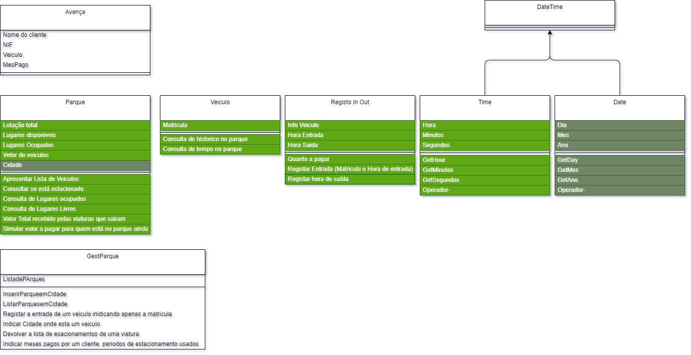
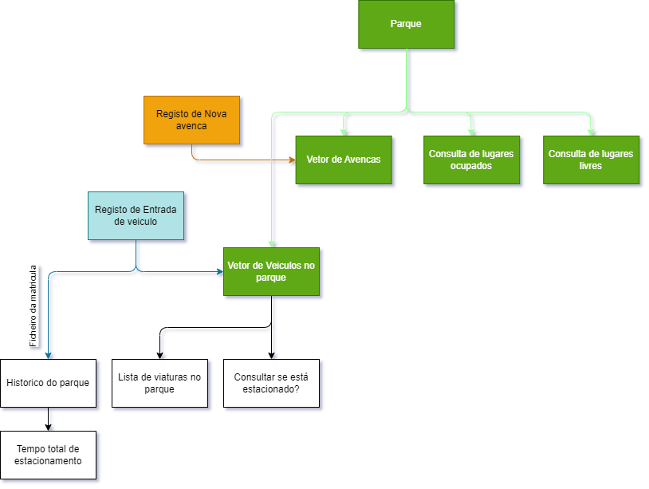
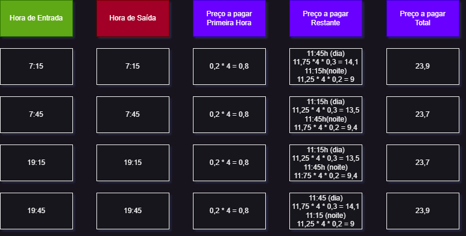

# IPCA-POO-TP1  
Educational project aiming to recreate a parking management application. 

## Project Files  
Our project inlcudes a draw_io fodler that was used as a flowchart for the final implementation. It didn't play such an important role on the 2nd part of the project, but was definitely useful.



The main_tests folder is most likely not working after the refactoring that occured on the 2nd part of the project and isn't taken into consideration on this report.
The __src__ and __inc__ folders are where all the required files exist for the project to work.

## Intro  
The project has a CLI menu used to manage several parks. We have used this in a context of a single company that can have multiple parks spread across different cities.  
Our approach will be similar to our colleagues, and it implements:  

- Vehicle registration (entry and exit including date and time references)
- Park subscription & Ticket calculation (after exit only) 
- Presents the occupation of the park
- Finds if a vehicle is parked 
- Consults the history of a vehicle in the park 
  
## Issues found  
Some of the issues found during the making of the project where:  
- Handling the time schedule: from 8h to 20h: The first hour is paid at 0,20€/15min, after the first hour it is 0,30€/15min;
                              from 20h to 8h: paid at 0,30€/15min;
- Handle the day addition and refactoring of the code in short notice; 

- Hierarchy to function properly for _DateTime_ class;
  
## Some of the fixes implemented  
The _IOregistry_ class is the one that handles most of the methods that were required for this project. The method for ticket calculation has a verification of the parking period the car is stationary in one of the parks, it then verifies if the amount of days passed are more or less than 1. With this, the ticket price is calculated accurately.  
The addition of a date required the code to change from using minutes only to seconds for a more accurate way to identify the days that passed. For this reason, and considering most of the code was using minutes as a reference to work, that took a lot of effort to modify across the project.  
The _Date_ and _Time_ classes were well defined, and it made more sense of a single class, _DateTime_, to inlcude 1 instance of each and make use of the operator overloads already in existance than to recreate the operator overloads that were already made. 

## Conclusions  
Although the assignment mentions the force implementation of hierarchy for the _DateTime_ class, it would be better suited using composition for this particular case.  
A better class for the use of hierarchy would have been the _vehicle_ class, if several types of vehicle where to be used.  
We were not abe to make use of the Qt library and test creating an interface with it, as the focus was primarly on setting up the functional part of our code first, and that was guarateed. 
The menu interaction in CLI could be better making use of _clear screen_ commands and parsing the date and time in a different way, but was made later in the project finishing stage so it was not implemented.
  
#### NOTES  
Sometimes, for both usecases, ```make builddir``` may be required, as _clean_ attempts to find it, and may fail if it doesn't exist.